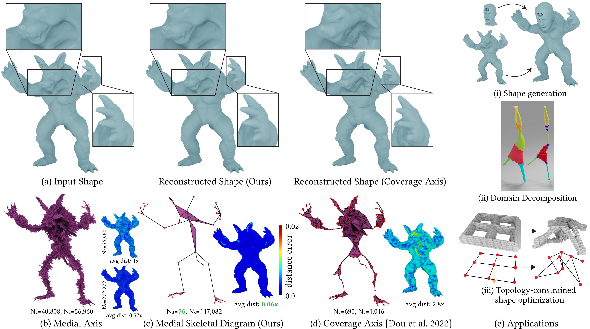

# Medial Skeletal Diagram: A Generalized Medial Axis Approach for Compact 3D Shape Representation

This repository contains the implementation code for our conditionally accepted SIGGRAPH Asia paper [Medial Skeletal Diagram: A Generalized Medial Axis Approach for Compact 3D Shape Representation](https://arxiv.org/pdf/2310.09395) (This is the arXiv version, the published version will come soon).


**We introduce the Medial Skeletal Diagram (MSD) -- a representation with a sparse skeleton that generalizes the medial axis.** Our representation reduces the number of discrete elements ($N_d$) required compared to both standard and simplified medial axes ((b) and (d)). This reduction is achieved while delivering the highest reconstruction accuracy (c). The sparsity of discrete elements and the completeness of our method facilitate a broad range of applications, such as shape generation, mesh decomposition, and shape optimization (e).

## Installation

1. Download [libpgo](https://github.com/bohanwang/libpgo), a C++ library with Python bindings for **P**hysically-based simulation, **G**eometric shape modeling, and **O**ptimization. Follow the instructions in the original [repo](https://github.com/bohanwang/libpgo) to get ``libpgo``.

    ```bash
    git clone git@github.com:bohanwang/libpgo.git
    ```

2. Clone this repo into the ``{libpgo_ROOT}/projects`` folder.

    ```bash
    cd libpgo/projects
    git clone git@github.com:bohanwang/MSD.git
    ```

3. Install prerequisites. Please refer to **Prerequisites** for ``libpgo``.

4. Build the repo.
    ```bash
    cd ../
    cmake -B build -S . -DPGO_ENABLE_FULL=1 -DPGO_USE_MKL=1 -DPGO_BUILD_SUBPROJECTS=1
    cmake --build build --target computeMSD --parallel
    ```
5. The built executable will be installed into ``build/bin/``.

Note that we have only tested it on Windows and Ubuntu 24.04.

## Examples
We provide a few examples in the ``examples`` folder. Please check them out there.

## TODO

- [ ] add support to user-defined medial axis
- [ ] release more examples

## License

See the ``LICENSE`` file.